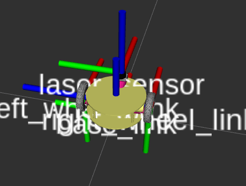

# Pocker_bot_vrep_description
Run launch file `robotstate_jointstate_rviz.launch` to visualize the urdf model in rviz.

You can find that the axis of the wheels are different compared to usual urdf. This is because, in vrep the joints are in similiar direction. Hence the axis of rotation in this case will be z axis rather than y axis in usual cases.

On launching `robotstate_jointstate_rviz.launch`, the robot_description is added to the parameter server and robot_state_publisher publishes the tf. In V-REP side you have to write a joint_state_publisher to publish its wheel velocity.

On running the launch file the following nodes run with the following topics:

Scan is published by model in vrep and you can accordingly visualize the scan in rviz as shown below:

